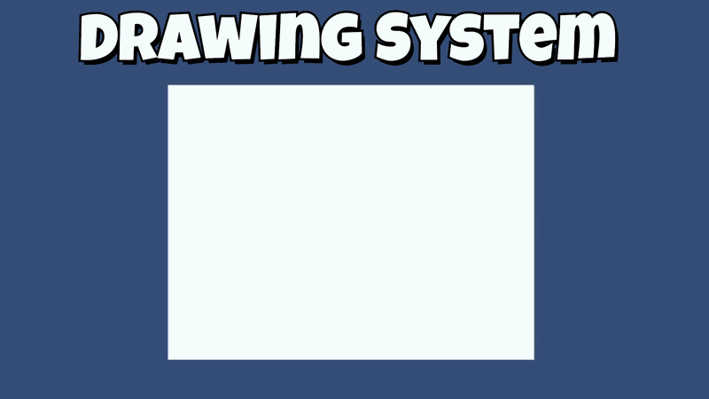

# Rasterbrush

A pixel drawing canvas for Unity. Brush, eraser, color picker and flood fill on a fast CPU-side buffer, displayed through a plain SpriteRenderer.

<br>

<p align="center">
  
</p>

<br>

## Tools

| | Tool | Description |
|---|---|---|
|  | **Brush** | Circle-stamped strokes, interpolated between frames so fast movement stays solid |
|  | **Eraser** | Same stroke pipeline, paints the background color |
|  | **Color picker** | Reads the color under the cursor into the brush |
|  | **Flood fill** | Queue-based fill, 4-connected so outlines hold ink |

## Features

- CPU-side `Color32` buffer with a single dirty-flag upload per frame
- Rotation-safe input mapping, so the canvas object can move, rotate and scale freely
- Strokes clip cleanly at canvas edges, including fast off-canvas cursor movement
- No per-pixel `SetPixel` calls, no shaders required, works with any SpriteRenderer

## Installation

Unity Package Manager: `Window > Package Manager > + > Add package from git URL`

```
https://github.com/YOURNAME/rasterbrush.git
```

Or copy the `Runtime` folder into your project.

## Quick start

1. Add `DrawingCanvas` to a GameObject with a `SpriteRenderer`.
2. Set width, height and pixels per unit in the inspector.
3. Press play and draw. Switch tools via the `tool` field or your own UI.

```csharp
// Draw from code
canvas.StampBrush(400, 300, 6, Color.black);
canvas.StampLine(from, to, 6, Color.black);
canvas.FloodFill(x, y, Color.red);
```

## License

[MIT](LICENSE)
